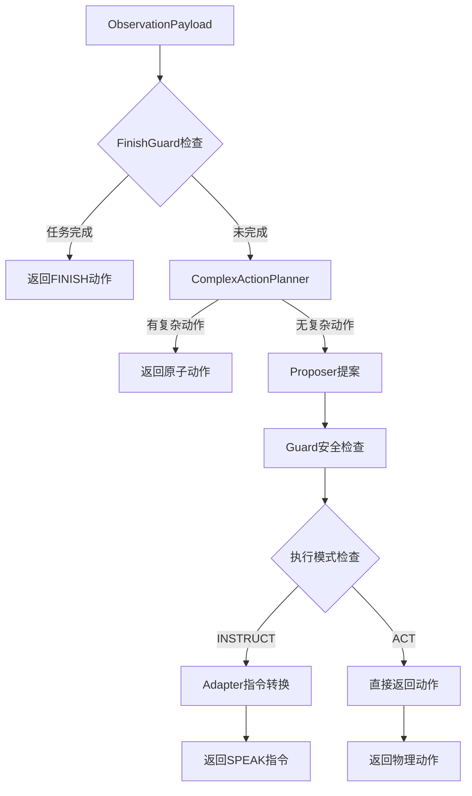

# Core 目录技术架构报告

## 概述

`adl-backend/core/` 目录是智能体系统的核心推理引擎，采用模块化、可扩展的架构设计。该目录实现了从观察输入到动作输出的完整推理管道，支持多种执行模式和配置选项。

## 架构设计理念

### 1. 模块化设计
- **单一职责原则**：每个模块负责特定的功能
- **清晰接口定义**：模块间通过明确定义的接口通信
- **可插拔组件**：支持运行时配置和组件替换

### 2. 确定性优先
- **MockProposer**：提供确定性输出用于测试
- **FinishGuard**：系统决定任务完成，不依赖LLM
- **模板化指令**：确保指令生成的100%可控性

### 3. 可观测性
- **结构化日志**：详细的调试信息
- **状态监控**：实时跟踪系统状态
- **错误处理**：完善的异常处理机制

### 4. 向后兼容
- **v1接口保持**：支持渐进式迁移
- **行为可回滚**：确保系统稳定性
- **配置驱动**：通过环境变量控制行为

## 核心模块详解

### 1. 推理管道 (reasoning_v2.py)

**职责**：协调整个推理流程，实现P2最小化管道

**核心流程**：
```
1. FinishGuard检查 → 如果任务完成，直接返回FINISH
2. ComplexActionPlanner → 处理复杂动作序列
3. Proposer提案 → 生成动作建议
4. Guard检查 → 安全验证和状态监控
5. Adapter转换 → 根据执行模式转换动作格式
```

**关键特性**：
- 支持两种执行模式：`ACT`（直接执行）和`INSTRUCT`（生成用户指令）
- 环境变量配置驱动
- 状态重置机制

### 2. 提案生成模块 (proposers_v2.py)

**职责**：生成动作建议，支持多种策略

**组件**：
- **V1Proposer**：生产环境使用，委托给v1推理引擎
- **MockProposer**：测试环境使用，提供确定性输出
  - 脚本优先：支持JSON脚本定义动作序列
  - 规则回退：基于状态机的规则系统

**提案优先级**：
1. 脚本输出（如果配置了REASONING_V2_MOCK_SCRIPT）
2. 目标驱动规则（基于GoalRegistry）
3. 状态机规则（基于当前世界状态）

### 3. 安全检查模块 (guards_v2.py)

**职责**：确保动作安全性和系统稳定性

**组件**：
- **FinishGuard**：确定性完成检测
  - 基于GoalRegistry验证目标
  - 系统决定任务完成，不依赖LLM
  - 支持会话和回合管理

- **StateStagnationGuard**：状态停滞检测
  - 滑动窗口监控状态变化
  - 检测任务相关状态停滞
  - 支持THINK或SPEAK覆盖

**状态签名**：
```python
task={task_key}|loc={location}|hold={holding}|red={red_cube_state}...
```

### 4. 适配器模块 (adapters_v2.py)

**职责**：动作格式转换，支持INSTRUCT模式

**功能**：
- 物理动作 → 用户指令转换
- 模板化指令生成（100%可控）
- 支持多种交互类型的中文指令

**模板示例**：
- MOVE_TO: "请先移动到 {target_poi}。"
- PICK: "请拿起 {item}。"
- PLACE: "请把当前物体放到 {item}。"

### 5. 复杂动作规划器 (complex_actions_v2.py)

**职责**：处理需要多步执行的复杂动作

**功能**：
- 原子动作序列管理
- 状态跟踪和进度管理
- 支持中断和恢复

### 6. 目标系统模块

**组件**：
- **goal_registry.py**：目标注册和管理
- **goal_evaluator.py**：目标评估和完成检测
- **goal_dsl.py**：目标定义语言

**目标类型**：
- MOVE_TO：移动到指定位置
- OPEN/CLOSE：打开/关闭物体
- PUT_IN：放置物体到容器
- OPEN_THEN_PUT_IN：先开后放复合动作

### 7. 辅助工具模块

**组件**：
- **common_v2.py**：共享工具函数
- **error_dictionary.py**：统一错误码管理
- **step_logger.py**：步骤执行日志
- **prompt_templates.py**：LLM提示词模板
- **watchdog.py**：看门狗异常检测

## 环境变量配置

| 变量 | 作用 | 默认值 | 说明 |
|------|------|--------|------|
| `REASONING_V2_PROPOSER` | 提案器类型 | `mock` | `mock` 或 `v1` |
| `REASONING_V2_MOCK_SCRIPT` | Mock脚本路径 | 空 | JSON格式动作序列 |
| `REASONING_V2_EXECUTION_MODE` | 执行模式 | `INSTRUCT` | `INSTRUCT` 或 `ACT` |
| `REASONING_V2_STAGNATION_WINDOW` | 停滞检测窗口 | `4` | 状态无变化步数阈值 |
| `REASONING_V2_STAGNATION_OVERRIDE` | 停滞覆盖类型 | `THINK` | `THINK` 或 `SPEAK` |
| `REASONING_V2_STAGNATION_MAX_KEYS` | 最大会话键数 | `256` | 内存管理参数 |

## 数据流分析

### 输入输出格式

**输入**：`ObservationPayload`
- 会话信息（session_id, episode_id, step_id）
- 智能体状态（位置、手持物）
- 世界状态（附近物体、全局任务）
- 可选目标提示（goal_spec）

**输出**：`ActionPayload`
- 动作类型（MOVE_TO, INTERACT, THINK, SPEAK, FINISH等）
- 目标物体/位置
- 交互类型（PICK, PLACE, OPEN等）
- 内容描述

### 处理流程



## 设计亮点

### 1. 确定性测试支持
- MockProposer提供完全确定性的输出
- 支持JSON脚本定义测试用例
- 便于回归测试和黄金测试

### 2. 系统决定完成
- FinishGuard不依赖LLM判断任务完成
- 基于GoalRegistry的目标验证
- 避免LLM幻觉导致的错误完成

### 3. 状态停滞检测
- 滑动窗口监控状态变化
- 防止智能体陷入死循环
- 自动触发策略调整

### 4. 模板化指令生成
- 100%可控的指令输出
- 支持中文用户指令
- 避免LLM生成不一致的指令

### 5. 可配置架构
- 环境变量驱动行为
- 支持运行时组件切换
- 便于A/B测试和实验

## 使用场景

### 开发测试阶段
```bash
# 使用MockProposer进行确定性测试
export REASONING_V2_PROPOSER=mock
export REASONING_V2_EXECUTION_MODE=INSTRUCT
export REASONING_V2_MOCK_SCRIPT=./test_script.json
```

### 生产部署阶段
```bash
# 使用V1Proposer进行LLM推理
export REASONING_V2_PROPOSER=v1
export REASONING_V2_EXECUTION_MODE=ACT
```

### 调试诊断阶段
```bash
# 启用详细日志和状态监控
export REASONING_V2_STAGNATION_WINDOW=3
export REASONING_V2_STAGNATION_OVERRIDE=SPEAK
```

## 性能考虑

### 内存管理
- 状态历史使用滑动窗口限制
- 会话键数有上限控制（默认256）
- 定期清理过期会话数据

### 计算复杂度
- 状态签名计算为O(n)，n为相关物体数量
- 停滞检测为O(1)窗口操作
- 目标解析使用缓存优化

### 扩展性
- 模块化设计支持新组件添加
- 协议接口便于实现替换
- 配置驱动支持不同部署场景

## 未来改进方向

### 1. 增强学习集成
- 添加基于反馈的提案优化
- 支持策略学习和调整
- 实现经验回放机制

### 2. 多模态支持
- 扩展ObservationPayload支持视觉输入
- 添加空间推理能力
- 支持更复杂的世界状态表示

### 3. 分布式部署
- 支持多智能体协同
- 添加消息队列集成
- 实现负载均衡和容错

### 4. 监控和告警
- 添加性能指标收集
- 实现异常自动告警
- 支持实时仪表板

## 总结

Core目录实现了一个高度模块化、可配置的智能体推理系统，具有以下核心优势：

1. **架构清晰**：模块职责明确，接口定义清晰
2. **确定性优先**：测试友好，行为可预测
3. **安全可靠**：多重安全检查，防止异常行为
4. **灵活可配**：支持多种执行模式和部署场景
5. **易于扩展**：模块化设计便于功能添加和修改

该系统为智能体在复杂环境中的决策提供了坚实的基础架构，既支持当前的厨房任务场景，也为未来的扩展和优化预留了充分的空间。